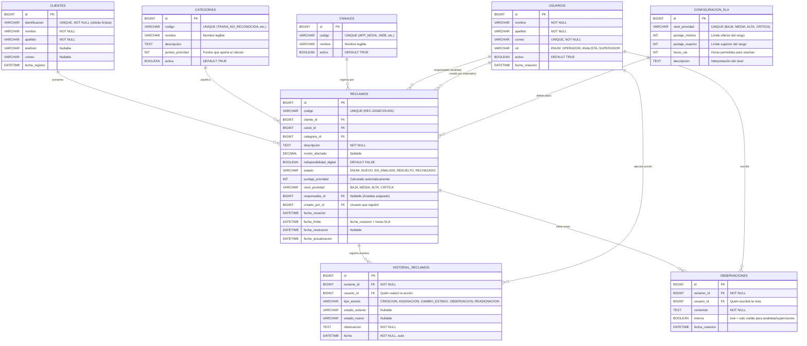
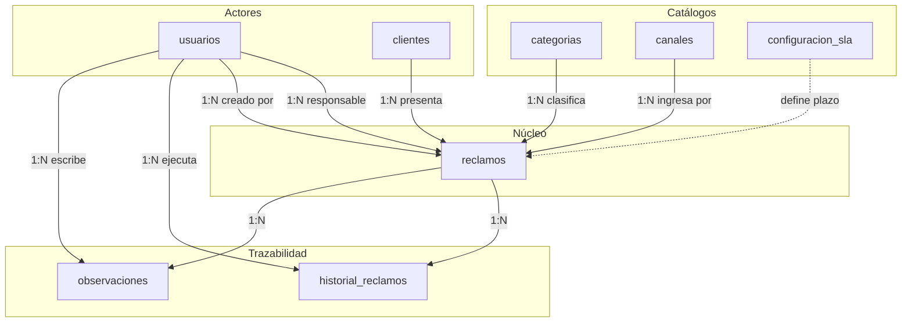

# Análisis de Base de Datos — FinResolve
## Perspectiva de Analista Empresarial

---

## Contexto de Negocio

El **Banco Horizonte** necesita centralizar la gestión de reclamos que hoy llegan por múltiples canales desorganizados. El sistema debe responder tres preguntas clave:

1. **¿Qué reclamos requieren atención inmediata?** → Priorización automática + SLA
2. **¿Quién atiende cada caso y en qué estado está?** → Asignación + trazabilidad
3. **¿Cuáles están próximos a incumplir su SLA?** → Alertas + tablero operativo

Desde esta óptica, identifico **8 tablas** organizadas en 3 capas lógicas.

---

## Diagrama Entidad-Relación Completo

---

## Detalle de Cada Tabla

### 🔵 Capa 1: Catálogos y Configuración
> Tablas que no cambian frecuentemente. Son la "columna vertebral" del sistema.

---

### 1. `usuarios`

**¿Por qué existe?** El documento define 3 perfiles (Operador, Analista, Supervisor) con acciones distintas. Aunque no hay autenticación real, necesitamos saber **quién hace qué** para la trazabilidad, el historial, y la asignación. Sin esta tabla, no podríamos responder: *"¿Quién registró este reclamo?"*, *"¿Quién cambió el estado?"*.

| Campo | Tipo | Restricción | Justificación |
|-------|------|-------------|---------------|
| `id` | BIGINT | PK, AUTO_INCREMENT | Identificador único |
| `nombre` | VARCHAR(100) | NOT NULL | Nombre del funcionario |
| `apellido` | VARCHAR(100) | NOT NULL | Apellido del funcionario |
| `correo` | VARCHAR(255) | UNIQUE, NOT NULL | Identificación en el sistema (ficticio) |
| `rol` | ENUM | OPERADOR, ANALISTA, SUPERVISOR | Determina qué acciones puede realizar |
| `activo` | BOOLEAN | DEFAULT TRUE | Permite desactivar sin eliminar |
| `fecha_creacion` | DATETIME | DEFAULT CURRENT_TIMESTAMP | Auditoría |

**Conexiones:**
- → `reclamos.responsable_id` (1 analista atiende N reclamos)
- → `reclamos.creado_por_id` (1 operador registra N reclamos)
- → `historial_reclamos.usuario_id` (1 usuario genera N eventos)
- → `observaciones.usuario_id` (1 usuario escribe N notas)

---

### 2. `clientes`

**¿Por qué existe?** El documento pide capturar "identificación ficticia" y "nombre" del cliente. Si lo dejamos como campos sueltos en `reclamos`, un mismo cliente con 3 reclamos tendría datos duplicados e inconsistentes. Normalizar esto permite:
- Ver **todos los reclamos de un cliente** rápidamente
- Evitar que el mismo cliente aparezca con nombres diferentes
- Futuro: historial del cliente, score de reclamos

| Campo | Tipo | Restricción | Justificación |
|-------|------|-------------|---------------|
| `id` | BIGINT | PK, AUTO_INCREMENT | Identificador interno |
| `identificacion` | VARCHAR(20) | UNIQUE, NOT NULL | Cédula/RUC ficticio del cliente |
| `nombre` | VARCHAR(100) | NOT NULL | Nombre del reclamante |
| `apellido` | VARCHAR(100) | NOT NULL | Apellido del reclamante |
| `telefono` | VARCHAR(20) | NULLABLE | Contacto opcional |
| `correo` | VARCHAR(255) | NULLABLE | Correo opcional |
| `fecha_registro` | DATETIME | DEFAULT CURRENT_TIMESTAMP | Primera vez que reclama |

**Conexiones:**
- → `reclamos.cliente_id` (1 cliente puede tener N reclamos)

---

### 3. `categorias`

**¿Por qué es una tabla y no un ENUM?** Las categorías tienen **lógica de negocio asociada**: cada una aporta puntos al cálculo de prioridad. Si mañana el banco agrega una categoría nueva (ej: "fraude digital") o cambia los puntos, basta con un INSERT o UPDATE en lugar de modificar código Java y recompilar.

| Campo | Tipo | Restricción | Justificación |
|-------|------|-------------|---------------|
| `id` | BIGINT | PK, AUTO_INCREMENT | Identificador |
| `codigo` | VARCHAR(50) | UNIQUE, NOT NULL | Código interno (TRANS_NO_RECONOCIDA) |
| `nombre` | VARCHAR(100) | NOT NULL | Nombre legible ("Transacción no reconocida") |
| `descripcion` | TEXT | NULLABLE | Explicación de la categoría |
| `puntos_prioridad` | INT | NOT NULL, DEFAULT 0 | Puntos que suma al cálculo de prioridad |
| `activa` | BOOLEAN | DEFAULT TRUE | Permite desactivar sin eliminar |

**Valores iniciales y sus puntos:**

| Código | Nombre | Puntos |
|--------|--------|--------|
| `TRANSACCION_NO_RECONOCIDA` | Transacción no reconocida | +4 |
| `COMPRA_NO_RECONOCIDA` | Compra no reconocida | +4 |
| `TRANSFERENCIA_NO_ACREDITADA` | Transferencia no acreditada | +3 |
| `ACCESO_BLOQUEADO` | Acceso/canal bloqueado | +3 |
| `COBRO_INDEBIDO` | Cobro indebido | 0 |
| `ERROR_CANAL_DIGITAL` | Error en canal digital | 0 |
| `ATENCION_DEFICIENTE` | Atención al cliente deficiente | 0 |

**Conexiones:**
- → `reclamos.categoria_id` (1 categoría clasifica N reclamos)

---

### 4. `canales`

**¿Por qué es una tabla?** Similar a categorías — el canal de ingreso tiene significado operativo. El documento menciona que "canal digital completamente indisponible" suma +2 puntos. Tener los canales catalogados permite filtrar y reportar: *"¿Cuántos reclamos llegan por app móvil vs. ventanilla?"*

| Campo | Tipo | Restricción | Justificación |
|-------|------|-------------|---------------|
| `id` | BIGINT | PK, AUTO_INCREMENT | Identificador |
| `codigo` | VARCHAR(30) | UNIQUE, NOT NULL | Código interno |
| `nombre` | VARCHAR(100) | NOT NULL | Nombre legible |
| `activo` | BOOLEAN | DEFAULT TRUE | Permite desactivar |

**Valores iniciales:**

| Código | Nombre |
|--------|--------|
| `VENTANILLA` | Ventanilla presencial |
| `APP_MOVIL` | Aplicación móvil |
| `WEB` | Banca web |
| `CALL_CENTER` | Call center |
| `CORREO` | Correo electrónico |

**Conexiones:**
- → `reclamos.canal_id` (1 canal recibe N reclamos)

---

### 5. `configuracion_sla`

**¿Por qué existe?** Las reglas de SLA (cuántas horas tiene cada prioridad) son **configuración de negocio**, no lógica hardcodeada. Si el banco decide que "Crítica" pase de 2 a 3 horas, es un UPDATE, no un cambio de código. Esta tabla es clave para que el cálculo de `fecha_limite` sea **datos reales**, no valores mágicos.

| Campo | Tipo | Restricción | Justificación |
|-------|------|-------------|---------------|
| `id` | BIGINT | PK, AUTO_INCREMENT | Identificador |
| `nivel_prioridad` | VARCHAR(20) | UNIQUE, NOT NULL | BAJA, MEDIA, ALTA, CRITICA |
| `puntaje_minimo` | INT | NOT NULL | Límite inferior del rango de puntaje |
| `puntaje_maximo` | INT | NOT NULL | Límite superior del rango |
| `horas_sla` | INT | NOT NULL | Horas permitidas para atender |
| `descripcion` | TEXT | NULLABLE | Interpretación ("Puede seguir flujo normal") |

**Valores:**

| Prioridad | Puntaje | SLA | Descripción |
|-----------|---------|-----|-------------|
| BAJA | 0–2 | 24h | Puede seguir el flujo normal |
| MEDIA | 3–4 | 12h | Requiere seguimiento durante la jornada |
| ALTA | 5–6 | 6h | Debe asignarse con rapidez |
| CRITICA | 7+ | 2h | Atención inmediata y visibilidad destacada |

**Conexiones:**
- → El servicio de prioridad consulta esta tabla para determinar `nivel_prioridad` y `fecha_limite` del reclamo.

---

### 🟢 Capa 2: Núcleo Transaccional

---

### 6. `reclamos`

**¿Por qué es la tabla central?** Es el **agregado principal** del sistema. Todo gira alrededor del reclamo: quién lo creó, qué cliente lo presenta, qué categoría tiene, quién lo atiende, en qué estado está, cuándo vence. Es la tabla que alimenta el tablero, los filtros y las alertas.

| Campo | Tipo | Restricción | Justificación |
|-------|------|-------------|---------------|
| `id` | BIGINT | PK, AUTO_INCREMENT | Identificador interno |
| `codigo` | VARCHAR(20) | UNIQUE, NOT NULL | Código legible (REC-20260729-001). Lo ve el cliente |
| `cliente_id` | BIGINT | FK → clientes, NOT NULL | Quién reclama |
| `canal_id` | BIGINT | FK → canales, NOT NULL | Por dónde ingresó |
| `categoria_id` | BIGINT | FK → categorias, NOT NULL | Qué tipo de reclamo es |
| `descripcion` | TEXT | NOT NULL | Detalle del reclamo |
| `monto_afectado` | DECIMAL(12,2) | NULLABLE | Monto involucrado (para cálculo de prioridad) |
| `indisponibilidad_digital` | BOOLEAN | DEFAULT FALSE | ¿El canal digital está caído para el cliente? (+2 puntos) |
| `estado` | ENUM | NUEVO, EN_ANALISIS, RESUELTO, RECHAZADO | Estado actual del workflow |
| `puntaje_prioridad` | INT | NOT NULL | Puntaje calculado automáticamente |
| `nivel_prioridad` | VARCHAR(20) | NOT NULL | BAJA, MEDIA, ALTA, CRITICA |
| `responsable_id` | BIGINT | FK → usuarios, NULLABLE | Analista asignado (null = sin asignar) |
| `creado_por_id` | BIGINT | FK → usuarios, NOT NULL | Operador que registró |
| `fecha_creacion` | DATETIME | NOT NULL, DEFAULT NOW | Cuándo se registró |
| `fecha_limite` | DATETIME | NOT NULL | fecha_creacion + horas_sla. Para alertas |
| `fecha_resolucion` | DATETIME | NULLABLE | Cuándo se cerró (Resuelto/Rechazado) |
| `fecha_actualizacion` | DATETIME | ON UPDATE CURRENT_TIMESTAMP | Última modificación |

**Conexiones:**
- ← `clientes.id` (cada reclamo pertenece a un cliente)
- ← `canales.id` (cada reclamo ingresó por un canal)
- ← `categorias.id` (cada reclamo tiene una categoría)
- ← `usuarios.id` (responsable + creado_por)
- → `historial_reclamos` (cada reclamo tiene N eventos)
- → `observaciones` (cada reclamo tiene N notas)

**Índices recomendados:**
- `idx_reclamos_estado` — Filtrar por estado
- `idx_reclamos_prioridad` — Filtrar por prioridad
- `idx_reclamos_fecha_limite` — Alertas SLA (ORDER BY fecha_limite)
- `idx_reclamos_responsable` — Reclamos por analista
- `idx_reclamos_codigo` — Búsqueda por código

---

### 🔴 Capa 3: Trazabilidad y Auditoría

---

### 7. `historial_reclamos`

**¿Por qué existe?** El documento exige **inmutabilidad** del historial. Cada acción sobre un reclamo (creación, asignación, cambio de estado, reasignación) debe quedar registrada con fecha, actor y observación. Sin esta tabla, no podríamos responder: *"¿Quién pasó este caso a Resuelto y cuándo?"* ni *"¿Cuántas veces fue reasignado?"*

| Campo | Tipo | Restricción | Justificación |
|-------|------|-------------|---------------|
| `id` | BIGINT | PK, AUTO_INCREMENT | Identificador |
| `reclamo_id` | BIGINT | FK → reclamos, NOT NULL | A qué reclamo pertenece |
| `usuario_id` | BIGINT | FK → usuarios, NOT NULL | Quién ejecutó la acción |
| `tipo_evento` | VARCHAR(30) | NOT NULL | Tipo de acción realizada |
| `estado_anterior` | VARCHAR(20) | NULLABLE | Estado antes del cambio |
| `estado_nuevo` | VARCHAR(20) | NULLABLE | Estado después del cambio |
| `observacion` | TEXT | NOT NULL | Nota obligatoria en cada transición |
| `fecha` | DATETIME | NOT NULL, DEFAULT NOW | Momento exacto del evento |

**Tipos de evento:**

| Código | Descripción |
|--------|-------------|
| `CREACION` | Reclamo registrado por primera vez |
| `ASIGNACION` | Analista asignado al caso |
| `REASIGNACION` | Caso transferido a otro analista |
| `CAMBIO_ESTADO` | Transición de estado (Nuevo → En análisis, etc.) |
| `OBSERVACION` | Nota agregada sin cambio de estado |
| `RECALCULO_PRIORIDAD` | Prioridad recalculada (ej: pasó 24h abierto) |

> [!IMPORTANT]
> Esta tabla es **append-only** (solo INSERT). No se permite UPDATE ni DELETE desde la interfaz. Es el registro de auditoría del sistema.

**Conexiones:**
- ← `reclamos.id` (cada evento pertenece a un reclamo)
- ← `usuarios.id` (cada evento fue ejecutado por un usuario)

---

### 8. `observaciones`

**¿Por qué existe separada del historial?** El historial registra **eventos del sistema** (cambios de estado, asignaciones). Las observaciones son **notas de trabajo** que los analistas y supervisores agregan durante la investigación del caso. Separar estas preocupaciones permite:
- Filtrar solo eventos vs. solo notas
- Marcar notas como "internas" (no visibles para un futuro portal del cliente)
- No contaminar la línea de tiempo de eventos con comentarios informales

| Campo | Tipo | Restricción | Justificación |
|-------|------|-------------|---------------|
| `id` | BIGINT | PK, AUTO_INCREMENT | Identificador |
| `reclamo_id` | BIGINT | FK → reclamos, NOT NULL | A qué reclamo pertenece |
| `usuario_id` | BIGINT | FK → usuarios, NOT NULL | Quién escribió la nota |
| `contenido` | TEXT | NOT NULL | Texto de la observación |
| `interna` | BOOLEAN | DEFAULT TRUE | ¿Es nota interna? |
| `fecha_creacion` | DATETIME | NOT NULL, DEFAULT NOW | Cuándo se escribió |

**Conexiones:**
- ← `reclamos.id` (cada nota pertenece a un reclamo)
- ← `usuarios.id` (cada nota tiene un autor)

---

## Mapa de Relaciones Resumido

---

## Resumen Ejecutivo

| # | Tabla | Capa | Registros estimados | Propósito |
|---|-------|------|---------------------|-----------|
| 1 | `usuarios` | Actores | ~10-20 | Quién opera el sistema |
| 2 | `clientes` | Actores | ~100-1000+ | Quién reclama |
| 3 | `categorias` | Catálogo | 7 fijos | Qué tipo de reclamo es |
| 4 | `canales` | Catálogo | 5 fijos | Por dónde ingresó |
| 5 | `configuracion_sla` | Catálogo | 4 fijos | Reglas de tiempo por prioridad |
| 6 | `reclamos` | Núcleo | Crece diariamente | El corazón del sistema |
| 7 | `historial_reclamos` | Auditoría | ~3-5x por reclamo | Qué pasó y cuándo |
| 8 | `observaciones` | Auditoría | ~2-3x por reclamo | Notas de trabajo del equipo |

---

## Decisiones de Diseño Clave

> [!TIP]
> **¿Por qué tablas de catálogo en vez de ENUMs en Java?**
> Porque las reglas de negocio (puntos de prioridad, horas SLA) quedan en la base de datos, no hardcodeadas. Esto permite que un supervisor cambie la configuración sin tocar código.

> [!TIP]
> **¿Por qué separar `clientes` de `reclamos`?**
> Un mismo cliente puede tener múltiples reclamos. Normalizar evita duplicación de datos y permite ver el historial completo de un cliente.

> [!TIP]
> **¿Por qué `usuarios` unificada en vez de `analistas` separada?**
> El documento menciona 3 perfiles. Una sola tabla con campo `rol` es más flexible, simplifica los FK en historial y observaciones, y permite que un usuario cambie de rol sin migrar datos.

> [!TIP]
> **¿Por qué `observaciones` separada de `historial_reclamos`?**
> El historial es un log de eventos del sistema (inmutable, automático). Las observaciones son notas de trabajo del equipo (manuales, con flag de visibilidad). Separar responsabilidades permite consultas más limpias y futuras extensiones (ej: adjuntar archivos a observaciones).

---

## ¿Qué opinas?

Necesito tu aprobación para:
1. ¿Estás de acuerdo con las **8 tablas** o preferirías simplificar/agregar algo?
2. ¿Te parece bien que categorías, canales y SLA sean **tablas de catálogo** en vez de enums en Java?
3. ¿Incluyo la tabla `observaciones` separada o prefieres que las notas vayan dentro del `historial_reclamos`?
