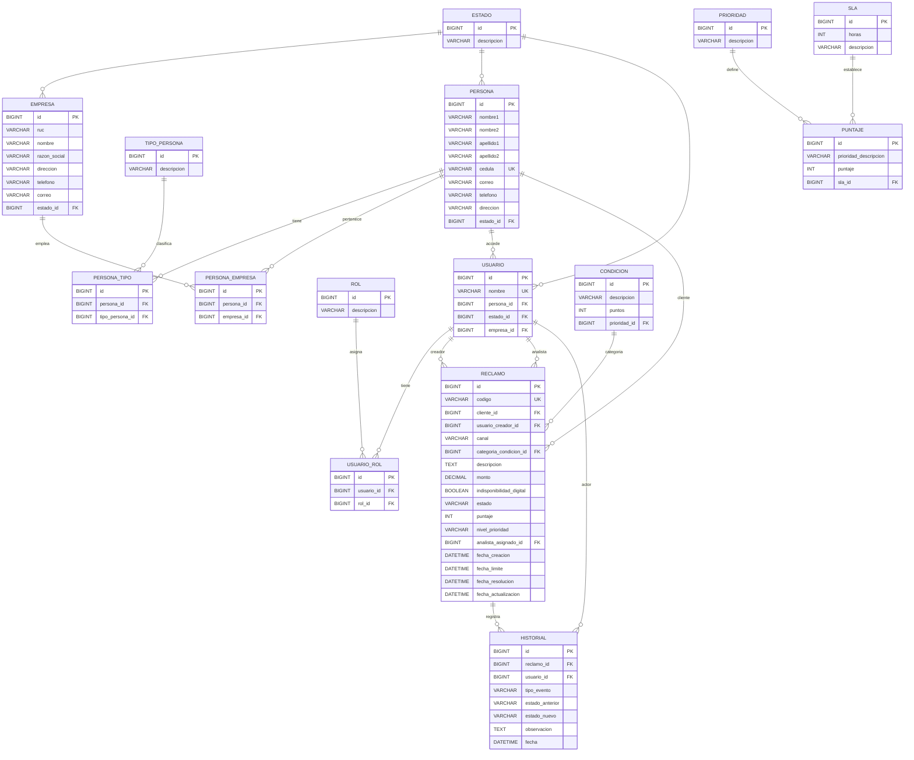

# Plan de Implementación — FinResolve MVP

## Stack Tecnológico

| Capa | Tecnología | Versión |
|------|-----------|---------|
| **Backend** | Spring Boot | 3.4.x |
| **Build** | Maven | — |
| **Java** | Java | 21 LTS |
| **ORM** | Spring Data JPA + Hibernate | — |
| **Migraciones** | Flyway | — |
| **API Docs** | SpringDoc OpenAPI | 2.8.x |
| **Frontend** | Next.js | 14+ (App Router) |
| **BD** | MySQL | 8+ |
| **Testing** | JUnit 5 + Mockito | — |
| **Auth** | Simulada (UserSelector) | Sin Spring Security |

---

## Modelo de Datos

### Tablas

```
╔══════════════════════════════════════════════════════════════╗
║                     TABLAS CATÁLOGO                          ║
╠══════════════════════════════════════════════════════════════╣
║ estado          → Activo, Inactivo                           ║
║ tipo_persona    → CLIENTE, ANALISTA                          ║
║ rol             → ADMINISTRADOR, OPERADOR, ANALISTA, SUPERVISOR ║
║ prioridad       → BAJA(0-2), MEDIA(3-4), ALTA(5-6), CRITICA(7+) ║
║ sla             → 24h, 12h, 6h, 2h                           ║
║ puntaje         → Mapeo rango→prioridad                      ║
║ condicion       → Reglas de negocio (+4, +3, +2 puntos)      ║
╚══════════════════════════════════════════════════════════════╝

╔══════════════════════════════════════════════════════════════╗
║                     TABLAS DE NEGOCIO                         ║
╠══════════════════════════════════════════════════════════════╣
║ persona          → Datos de la persona (nombre, cedula, etc) ║
║ persona_tipo     → N:M persona ⟷ tipo_persona                ║
║ empresa          → Banco Horizonte                           ║
║ persona_empresa  → N:M persona ⟷ empresa                     ║
║ usuario          → Acceso al sistema (login name)            ║
║ usuario_rol      → N:M usuario ⟷ rol                         ║
║ reclamo          → Entidad principal del sistema             ║
║ historial        → Trazabilidad inmutable                    ║
╚══════════════════════════════════════════════════════════════╝
```

### Diagrama DER



### Enums en código

| Campo | Valores |
|-------|---------|
| **Estado reclamo** | `NUEVO`, `EN_ANALISIS`, `RESUELTO`, `RECHAZADO` |
| **Canal** | `VENTANILLA`, `APP_MOVIL`, `WEB`, `CALL_CENTER`, `CORREO` |
| **Tipo evento historial** | `CREACION`, `ASIGNACION`, `REASIGNACION`, `CAMBIO_ESTADO` |
| **Tipo persona** | `CLIENTE`, `ANALISTA` |
| **Rol** | `ADMINISTRADOR`, `OPERADOR`, `ANALISTA`, `SUPERVISOR` |

---

## Reglas de Negocio

### Cálculo de Prioridad (RF-02)

```
puntaje = 0

if categoria in (TRANSACCION_NO_RECONOCIDA, COMPRA_NO_RECONOCIDA) → +4
if categoria in (TRANSFERENCIA_NO_ACREDITADA, ACCESO_BLOQUEADO)   → +3
if monto >= 500                                                    → +3
if indisponibilidad_digital == true                                → +2
if (ahora - fecha_creacion > 24h) AND estado in (NUEVO, EN_ANALISIS) → +2

Puntaje 0-2 → BAJA    → SLA 24h
Puntaje 3-4 → MEDIA   → SLA 12h
Puntaje 5-6 → ALTA    → SLA 6h
Puntaje 7+  → CRITICA → SLA 2h
```

### Alertas SLA (RF-08)
- **Dentro del plazo**: tiempo consumido < 75% del SLA
- **Próximo a vencer**: tiempo consumido >= 75% del SLA y no resuelto/rechazado
- **Vencido**: fecha_actual > fecha_limite y no resuelto/rechazado

### Transiciones de Estado (RF-06)
```
NUEVO → EN_ANALISIS → RESUELTO
                    → RECHAZADO
```
No se permite volver de RESUELTO o RECHAZADO a estados abiertos. Cada transición requiere observación.

---

## API REST — Endpoints

Base URL: `http://localhost:8080/api`

### Reclamos

| Método | Endpoint | Descripción | RF |
|--------|----------|-------------|-----|
| `POST` | `/reclamos` | Crear reclamo (calcula prioridad y SLA automáticamente) | RF-01, RF-02 |
| `GET` | `/reclamos` | Listar con filtros (estado, prioridad, categoria, canal, responsable) y busqueda (codigo, cliente) | RF-03 |
| `GET` | `/reclamos/{id}` | Detalle completo con historial | RF-04 |
| `PATCH` | `/reclamos/{id}/asignar` | Asignar/reasignar responsable | RF-05 |
| `PATCH` | `/reclamos/{id}/estado` | Cambiar estado (con validacion de transicion + observacion) | RF-06 |

### Tablero

| Método | Endpoint | Descripción | RF |
|--------|----------|-------------|-----|
| `GET` | `/dashboard/resumen` | Totales: todos, abiertos, resueltos, vencidos, proximos a vencer | RF-07 |
| `GET` | `/dashboard/por-prioridad` | Distribucion por prioridad | RF-07 |
| `GET` | `/dashboard/por-categoria` | Distribucion por categoria | RF-07 |

### Usuarios / Personas

| Método | Endpoint | Descripción |
|--------|----------|-------------|
| `GET` | `/analistas` | Listar personas con tipo ANALISTA activas |
| `GET` | `/usuarios` | Listar usuarios del sistema |
| `GET` | `/usuarios/{id}/roles` | Roles del usuario |

### Health

| Método | Endpoint |
|--------|----------|
| `GET` | `/public/health` |

---

## Estructura del Backend

```
backend/src/main/java/com/bancohorizonte/finresolve/
├── FinResolveApplication.java
├── config/
│   ├── OpenApiConfig.java
│   └── WebConfig.java (CORS)
├── controller/
│   ├── HealthController.java        (existe)
│   ├── ReclamoController.java       [NEW]
│   ├── DashboardController.java     [NEW]
│   └── UsuarioController.java       [NEW]
├── dto/
│   ├── ReclamoRequest.java          [NEW]
│   ├── ReclamoResponse.java         [NEW]
│   ├── AsignarRequest.java          [NEW]
│   ├── CambioEstadoRequest.java     [NEW]
│   ├── DashboardResumen.java        [NEW]
│   ├── HistorialResponse.java       [NEW]
│   └── UsuarioResponse.java         [NEW]
├── exception/
│   ├── GlobalExceptionHandler.java  (existe, ampliar)
│   └── ResourceNotFoundException.java (existe)
├── model/
│   ├── Persona.java                 [NEW]
│   ├── PersonaTipo.java             [NEW]
│   ├── TipoPersona.java             [NEW]
│   ├── Usuario.java                 [NEW]
│   ├── UsuarioRol.java              [NEW]
│   ├── Rol.java                     [NEW]
│   ├── Reclamo.java                 [NEW]
│   ├── Historial.java               [NEW]
│   ├── Prioridad.java               [NEW]
│   ├── Sla.java                     [NEW]
│   ├── Puntaje.java                 [NEW]
│   ├── Condicion.java               [NEW]
│   ├── Empresa.java                 [NEW]
│   └── Estado.java                  [NEW]
├── repository/
│   ├── ReclamoRepository.java       [NEW]
│   ├── PersonaRepository.java       [NEW]
│   ├── UsuarioRepository.java       [NEW]
│   ├── HistorialRepository.java     [NEW]
│   └── ... (demás repos)
└── service/
    ├── ReclamoService.java          [NEW]
    ├── PrioridadService.java        [NEW]
    ├── EstadoService.java           [NEW]
    ├── DashboardService.java        [NEW]
    └── UsuarioService.java          [NEW]
```

---

## Estructura del Frontend (Next.js App Router)

```
frontend/
├── package.json
├── next.config.js
├── tsconfig.json
├── tailwind.config.ts
├── public/
└── src/
    ├── app/
    │   ├── layout.tsx
    │   ├── page.tsx               ← redirige a /reclamos
    │   ├── reclamos/
    │   │   ├── page.tsx           ← listado con filtros (RF-03)
    │   │   ├── nuevo/
    │   │   │   └── page.tsx       ← formulario crear (RF-01)
    │   │   └── [id]/
    │   │       └── page.tsx       ← detalle + historial (RF-04, RF-05, RF-06)
    │   └── tablero/
    │       └── page.tsx           ← dashboard (RF-07, RF-08)
    ├── components/
    │   ├── layout/
    │   │   ├── Sidebar.tsx
    │   │   ├── Navbar.tsx
    │   │   └── UserSelector.tsx   ← simula usuario activo
    │   ├── reclamos/
    │   │   ├── ReclamoForm.tsx
    │   │   ├── ReclamoTable.tsx
    │   │   ├── FiltrosPanel.tsx
    │   │   └── HistorialTimeline.tsx
    │   ├── tablero/
    │   │   ├── MetricCard.tsx
    │   │   ├── DistribucionChart.tsx
    │   │   └── AlertasSLA.tsx
    │   └── ui/
    │       ├── Badge.tsx
    │       ├── Modal.tsx
    │       └── Button.tsx
    ├── lib/
    │   └── api.ts                 ← cliente HTTP
    ├── hooks/
    │   ├── useReclamos.ts
    │   └── useTablero.ts
    └── types/
        └── index.ts               ← interfaces TS (espejo de DTOs)
```

### Páginas Principales

1. **Dashboard** (`/tablero`) — Tablero operativo con KPIs, graficos de distribucion, alertas SLA
2. **Lista de Reclamos** (`/reclamos`) — Tabla con filtros, busqueda, badges de prioridad/SLA
3. **Nuevo Reclamo** (`/reclamos/nuevo`) — Formulario de registro
4. **Detalle Reclamo** (`/reclamos/:id`) — Info completa, asignar analista, cambiar estado, historial

---

## Datos de Demostracion (RF-10)

Se crearan via Flyway migration (V2__seed_data.sql):
- **1 empresa**: Banco Horizonte
- **2 tipos persona**: CLIENTE, ANALISTA
- **4 personas**: variadas (algunas solo CLIENTE, otras CLIENTE+ANALISTA)
- **4 roles**: ADMINISTRADOR, OPERADOR, ANALISTA, SUPERVISOR
- **4 usuarios**: mgalarza (ADMIN+OPERADOR), cloor (OPERADOR), jocana (ANALISTA), bajana (ANALISTA+SUPERVISOR)
- **4 prioridades**: BAJA, MEDIA, ALTA, CRITICA
- **4 SLA**: 24h, 12h, 6h, 2h
- **12 reclamos ficticios**: variados en categoria, canal, estado, prioridad y SLA

---

## Pruebas Automatizadas (minimo 3)

| Test | Clase | Que verifica |
|------|-------|-------------|
| Calculo de prioridad | `PrioridadServiceTest` | Puntaje y nivel correcto segun reglas |
| Calculo de fecha limite SLA | `PrioridadServiceTest` | Fecha limite = fecha_creacion + horas SLA |
| Transicion de estado valida | `EstadoServiceTest` | Solo permite NUEVO→EN_ANALISIS→RESUELTO/RECHAZADO |
| Transicion invalida | `EstadoServiceTest` | Rechaza RESUELTO→EN_ANALISIS |

---

## Orden de Implementacion

1. **Base de datos** — Flyway V1: schema completo + V2: datos demo
2. **Backend: Modelos JPA** — Todas las entidades con sus relaciones
3. **Backend: Repositorios** — Spring Data JPA repos
4. **Backend: Servicios** — PrioridadService (reglas), EstadoService (maquina), ReclamoService, DashboardService
5. **Backend: DTOs** — Request/Response records
6. **Backend: Controllers** — Endpoints REST
7. **Backend: Exception Handler** — Manejo global de errores
8. **Backend: Tests** — 4 pruebas automatizadas
9. **Frontend: Config inicial** — Next.js + Tailwind + tipos TS
10. **Frontend: Componentes base** — Layout, Navbar, UserSelector, Badges, UI
11. **Frontend: Paginas** — Dashboard, Lista, Detalle, Nuevo Reclamo
12. **Integracion** — Conectar frontend ↔ backend
13. **Polish** — Alertas SLA visuales, responsive, manejo de errores
14. **README** — Documentacion completa segun seccion 11.1 del PDF

---

## Cambios Respecto al Plan Original

| Aspecto | Plan original | Corregido |
|---------|--------------|-----------|
| Package | `com.finresolve` | `com.bancohorizonte.finresolve` |
| Java | 17 | 21 |
| Spring Boot | 3.3.2 | 3.4.x |
| Roles | ENUM en usuarios (1 rol) | Tabla intermedia `usuario_rol` (N:M) |
| Tipos persona | `clientes` y `usuarios` separados | `persona` + `persona_tipo` (N:M) |
| Seguridad | Spring Security | Sin auth, UserSelector simulado |
| Migraciones | ddl-auto=update | Flyway + ddl-auto=validate |
| Frontend | Vite + React | Next.js 14+ (App Router) |
| API Docs | No | SpringDoc OpenAPI (Swagger) |
| Observaciones | Tabla separada | Todo en `historial` (MVP) |
