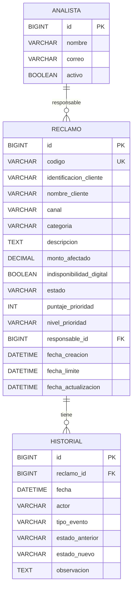

# Plan de Implementación — FinResolve MVP

## Resumen del Reto

Construir un **MVP web funcional** para gestionar reclamos financieros del **Banco Horizonte** (ficticio). El sistema debe registrar, priorizar automáticamente, asignar, dar seguimiento y visualizar reclamos, con un tablero operativo y alertas de SLA.

---

## User Review Required

> [!IMPORTANT]
> **Contraseña MySQL**: El plan asume que tienes MySQL corriendo en `localhost:3306` con usuario `root`. Necesito que me confirmes tus credenciales o si prefieres usar otra configuración.

> [!IMPORTANT]
> **Alcance**: El documento tiene 10 requerimientos funcionales (RF-01 a RF-10). El plan los cubre todos. ¿Quieres que implemente alguna funcionalidad opcional (CSV export, Kanban, modo oscuro, gráficos de tendencia)?

> [!WARNING]
> **Autenticación**: Según el brief, NO se exige autenticación real. Se simulará con un selector de usuario (Operador, Analista, Supervisor). ¿Estás de acuerdo?

---

## Open Questions

1. ¿Tienes **Maven** instalado y en el PATH? (vi el zip en Downloads)
2. ¿Tienes **MySQL** ya corriendo? ¿Cuál es la contraseña del usuario root?
3. ¿Quieres que use **react-router-dom** para navegación entre páginas?
4. ¿Alguna librería de gráficos preferida para el tablero? (sugiero **Recharts**)

---

## Modelo de Datos (MySQL)



### Entidades

| Entidad | Campos clave | Notas |
|---------|-------------|-------|
| **Reclamo** | código único legible (ej: `REC-20260729-001`), categoría, canal, monto, estado, puntaje, prioridad, SLA | Agregado principal |
| **Analista** | nombre, correo ficticio, activo | Catálogo simple, sin auth |
| **Historial** | reclamo_id, tipo_evento, estado anterior/nuevo, observación | Inmutable desde la interfaz |

### Enums/Catálogos

| Campo | Valores |
|-------|---------|
| **Estado** | `NUEVO`, `EN_ANALISIS`, `RESUELTO`, `RECHAZADO` |
| **Prioridad** | `BAJA`, `MEDIA`, `ALTA`, `CRITICA` |
| **Canal** | `VENTANILLA`, `APP_MOVIL`, `WEB`, `CALL_CENTER`, `CORREO` |
| **Categoría** | `TRANSACCION_NO_RECONOCIDA`, `COMPRA_NO_RECONOCIDA`, `TRANSFERENCIA_NO_ACREDITADA`, `ACCESO_BLOQUEADO`, `COBRO_INDEBIDO`, `ERROR_CANAL_DIGITAL`, `ATENCION_DEFICIENTE` |

---

## Reglas de Negocio

### Cálculo de Prioridad (RF-02)

```
puntaje = 0

if categoría in (TRANSACCION_NO_RECONOCIDA, COMPRA_NO_RECONOCIDA) → +4
if categoría in (TRANSFERENCIA_NO_ACREDITADA, ACCESO_BLOQUEADO)   → +3
if monto >= 500                                                    → +3
if indisponibilidad_digital == true                                → +2
if (ahora - fecha_creación > 24h) AND estado in (NUEVO, EN_ANALISIS) → +2

Puntaje 0-2 → BAJA    → SLA 24h
Puntaje 3-4 → MEDIA   → SLA 12h
Puntaje 5-6 → ALTA    → SLA 6h
Puntaje 7+  → CRITICA → SLA 2h
```

### Alertas SLA (RF-08)
- **Dentro del plazo**: `tiempo_consumido < 75% del SLA`
- **Próximo a vencer**: `tiempo_consumido >= 75% del SLA` y no resuelto/rechazado
- **Vencido**: `fecha_actual > fecha_límite` y no resuelto/rechazado

### Transiciones de Estado (RF-06)
```
NUEVO → EN_ANALISIS → RESUELTO
                    → RECHAZADO
```
No se permite volver de RESUELTO o RECHAZADO a estados abiertos. Cada transición requiere observación.

---

## API REST — Endpoints

### Reclamos

| Método | Endpoint | Descripción | RF |
|--------|----------|-------------|-----|
| `POST` | `/reclamos` | Crear reclamo (calcula prioridad y SLA automáticamente) | RF-01, RF-02 |
| `GET` | `/reclamos` | Listar con filtros (estado, prioridad, categoría, canal, responsable) y búsqueda (código, cliente) | RF-03 |
| `GET` | `/reclamos/{id}` | Detalle completo con historial | RF-04 |
| `PATCH` | `/reclamos/{id}/asignar` | Asignar/reasignar responsable | RF-05 |
| `PATCH` | `/reclamos/{id}/estado` | Cambiar estado (con validación de transición + observación) | RF-06 |

### Tablero

| Método | Endpoint | Descripción | RF |
|--------|----------|-------------|-----|
| `GET` | `/dashboard/resumen` | Totales: todos, abiertos, resueltos, vencidos, próximos a vencer | RF-07 |
| `GET` | `/dashboard/por-prioridad` | Distribución por prioridad | RF-07 |
| `GET` | `/dashboard/por-categoria` | Distribución por categoría | RF-07 |

### Analistas

| Método | Endpoint | Descripción |
|--------|----------|-------------|
| `GET` | `/analistas` | Listar analistas activos |

### Health

| Método | Endpoint | Descripción |
|--------|----------|-------------|
| `GET` | `/public/health` | Health check (ya existe) |

---

## Estructura del Backend

```
backend/src/main/java/com/finresolve/
├── FinResolveApplication.java
├── config/
│   ├── CorsConfig.java                  (ya existe)
│   └── SecurityConfig.java              (ya existe)
├── controller/
│   ├── HealthController.java            (ya existe)
│   ├── ReclamoController.java           [NEW]
│   ├── AnalistaController.java          [NEW]
│   └── DashboardController.java         [NEW]
├── dto/
│   ├── ReclamoRequest.java              [NEW]
│   ├── ReclamoResponse.java             [NEW]
│   ├── ReclamoDetalleResponse.java      [NEW]
│   ├── AsignarRequest.java              [NEW]
│   ├── CambioEstadoRequest.java         [NEW]
│   ├── DashboardResumen.java            [NEW]
│   └── HistorialResponse.java           [NEW]
├── exception/
│   ├── GlobalExceptionHandler.java      (ya existe, se amplía)
│   └── ResourceNotFoundException.java   (ya existe)
├── model/
│   ├── Reclamo.java                     [NEW]
│   ├── Analista.java                    [NEW]
│   ├── Historial.java                   [NEW]
│   └── enums/
│       ├── Estado.java                  [NEW]
│       ├── Prioridad.java               [NEW]
│       ├── Canal.java                   [NEW]
│       └── Categoria.java              [NEW]
├── repository/
│   ├── ReclamoRepository.java           [NEW]
│   ├── AnalistaRepository.java          [NEW]
│   └── HistorialRepository.java         [NEW]
└── service/
    ├── ReclamoService.java              [NEW]
    ├── PrioridadService.java            [NEW]  ← Reglas de negocio
    └── DashboardService.java            [NEW]
```

---

## Estructura del Frontend

```
frontend/src/
├── main.jsx
├── App.jsx                              [MODIFY] → Router setup
├── index.css                            [MODIFY] → Design system
├── App.css                              [DELETE/REPLACE]
├── services/
│   └── apiClient.js                     (ya existe)
├── components/
│   ├── Navbar.jsx                       [NEW]
│   ├── ReclamoCard.jsx                  [NEW]
│   ├── ReclamoForm.jsx                  [NEW]
│   ├── ReclamoFilters.jsx               [NEW]
│   ├── ReclamoDetalle.jsx               [NEW]
│   ├── HistorialTimeline.jsx            [NEW]
│   ├── SlaBadge.jsx                     [NEW]
│   ├── PrioridadBadge.jsx              [NEW]
│   ├── EstadoBadge.jsx                  [NEW]
│   ├── DashboardCard.jsx               [NEW]
│   └── UserSelector.jsx                [NEW] ← Simula usuario activo
├── pages/
│   ├── Dashboard.jsx                    [NEW]
│   ├── ReclamosList.jsx                 [NEW]
│   ├── ReclamoDetallePage.jsx           [NEW]
│   └── NuevoReclamo.jsx                [NEW]
└── utils/
    └── sla.js                           [NEW] ← Cálculos de tiempo SLA
```

### Páginas Principales

1. **Dashboard** (`/`) — Tablero operativo con KPIs, gráficos de distribución, alertas SLA
2. **Lista de Reclamos** (`/reclamos`) — Tabla con filtros, búsqueda, badges de prioridad/SLA
3. **Nuevo Reclamo** (`/reclamos/nuevo`) — Formulario de registro
4. **Detalle Reclamo** (`/reclamos/:id`) — Info completa, asignar analista, cambiar estado, historial

---

## Dependencias Adicionales a Instalar

### Frontend (npm)
- `react-router-dom` — Navegación entre páginas
- `recharts` — Gráficos para el tablero
- `react-icons` — Íconos

### Backend (ya configurado en pom.xml)
- Spring Boot Web, JPA, Security, MySQL, Lombok, DevTools ✅

---

## Datos de Demostración (RF-10)

Se crearán **12 reclamos ficticios** variados que cubran:
- Todas las categorías y canales
- Todos los estados (NUEVO, EN_ANALISIS, RESUELTO, RECHAZADO)
- Todas las prioridades (BAJA, MEDIA, ALTA, CRITICA)
- Casos vencidos, próximos a vencer y dentro del plazo
- 4 analistas ficticios

---

## Pruebas Automatizadas (mínimo 3)

| Test | Clase | Qué verifica |
|------|-------|-------------|
| Cálculo de prioridad | `PrioridadServiceTest` | Puntaje y nivel correcto según reglas |
| Cálculo de fecha límite SLA | `PrioridadServiceTest` | Fecha límite = fecha_creación + horas SLA |
| Transición de estado válida | `ReclamoServiceTest` | Solo permite NUEVO→EN_ANALISIS→RESUELTO/RECHAZADO |

---

## Verificación

### Automated Tests
```bash
cd backend
mvn test
```

### Manual Verification
1. Ejecutar el flujo crítico completo descrito en la sección 4.1 del documento:
   - Operador registra reclamo de "transacción no reconocida" por USD 780 desde app móvil
   - Sistema clasifica, calcula SLA, genera código
   - Supervisor asigna a analista
   - Analista cambia a "En análisis", agrega observación
   - Analista marca como "Resuelto"
   - Historial conserva cada paso
   - Tablero actualiza indicadores
2. Verificar filtros y búsqueda
3. Verificar alertas visuales de SLA (dentro, próximo, vencido)

---

## Orden de Implementación

1. **Base de datos** — Schema completo + datos de demostración
2. **Backend: Modelos y Enums** — Entidades JPA
3. **Backend: Servicios** — PrioridadService (reglas), ReclamoService, DashboardService
4. **Backend: Controllers + DTOs** — Endpoints REST
5. **Backend: Tests** — 3 pruebas automatizadas mínimas
6. **Frontend: Design System** — CSS base, colores, tipografía
7. **Frontend: Componentes** — Navbar, badges, cards, formulario, filtros
8. **Frontend: Páginas** — Dashboard, Lista, Detalle, Nuevo Reclamo
9. **Integración** — Conectar frontend ↔ backend
10. **Datos demo** — Verificar los 12 reclamos ficticios
11. **Polish** — Alertas SLA visuales, responsive, manejo de errores
12. **README** — Documentación completa según sección 11.1
